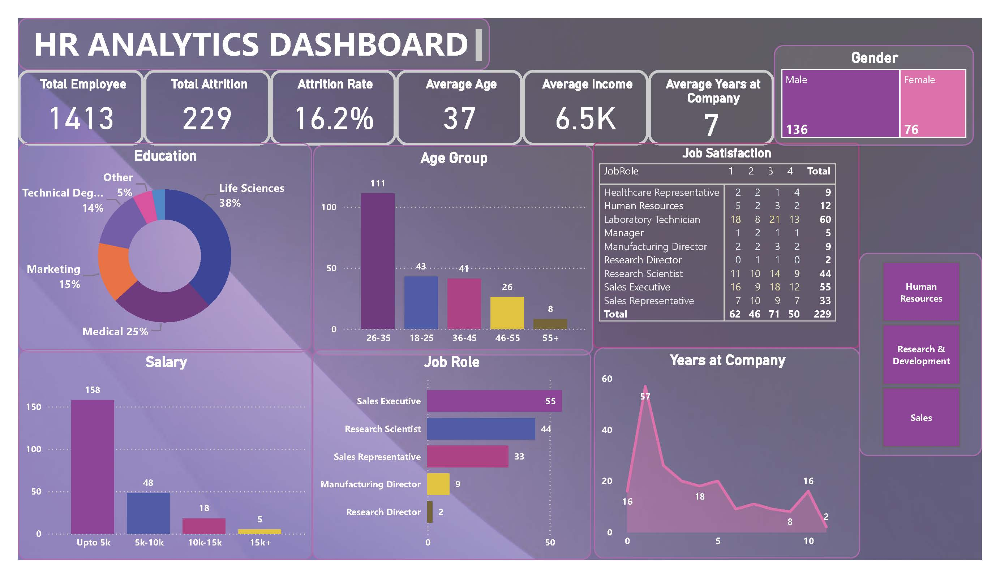

# HR Analytics Dashboard (Power BI)

This project presents a Power BI dashboard developed to extract meaningful insights from employee data. It helps organizations monitor attrition trends, job satisfaction, workforce distribution, and demographics to improve HR decision-making and employee retention.

---

## Objective

To explore key drivers of employee attrition and workforce performance, enabling actionable strategies to optimize recruitment, satisfaction, and retention.

---

## Dataset Overview

- **Source File**: `HR_Analytics.csv`
- **Total Employees**: 1,413  
- **Key Fields**: Age, Gender, Department, Salary, Education, Years at Company, Job Satisfaction, Attrition

---

## Key Insights

- **Attrition Rate**: 16.2% (229 employees left)
- **Average Age**: 37 years  
- **Average Salary**: 6.5K  
- **Top Age Group in Attrition**: 26–35 years  
- **Education Backgrounds**: 38% in Life Sciences, 25% in Medical  
- **Low Satisfaction**: 27% of Lab Technicians scored 1 on job satisfaction  
- **Job Roles with High Attrition**: Sales Executive (55), Research Scientist (44)  
- **Tenure Drop-off**: Peak attrition at the 2-year mark

---

## Tools & Techniques

- **Excel**: Data cleaning and preparation  
- **Power BI**: Data modeling and interactive dashboard creation  
- **Visual Components**:
  - Bar Charts, Donut Charts, Line Graphs
  - Slicers for department, gender, education
  - Cards for KPIs (attrition rate, average salary, etc.)

---

## Features

- Filters to view data by department, gender, job role
- Visual tracking of attrition by salary, age group, and years at company
- Heatmap of job satisfaction distribution
- Department-level breakdown of workforce

---

## 📸 Preview

---
